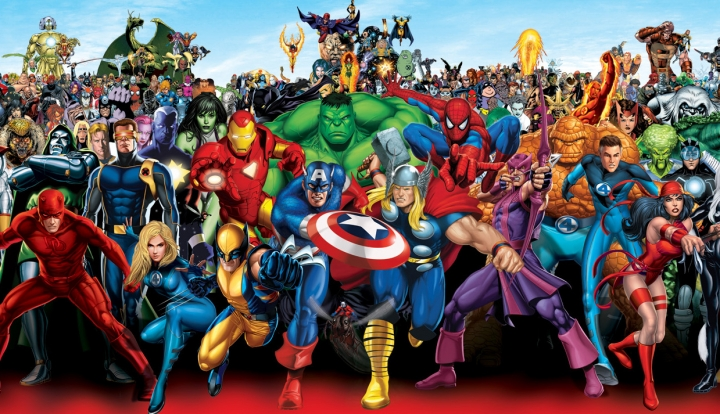

<h1>API PROJECT</h1>
<h2>Super Heroes Universe</h2>

<h3>Things to consider before using</h3>

This project is using a API created by <a href="https://superheroapi.com/index.html">Superhero API</a>. This API works with a generated token of Facebook, so for the correct use of the database we create a Proxy Connection.

For this reason, the result after clicked the button "Let's Go!" it can be a delay of 2 or 3 seconds.

<h3>Technologies used</h3>

For this project I used the next tecnologies:
<ul>
<li> html 5</li>
<li> CSS 3 (Responsive design)</li>
<li> Vanilla JavaScript</li>
<li> Github Pages</li>
</ul>

You can discover more projects on <a href="https://primerocomunico.github.io/portfolio/"> My Portfolio</a>
<!--  -->
